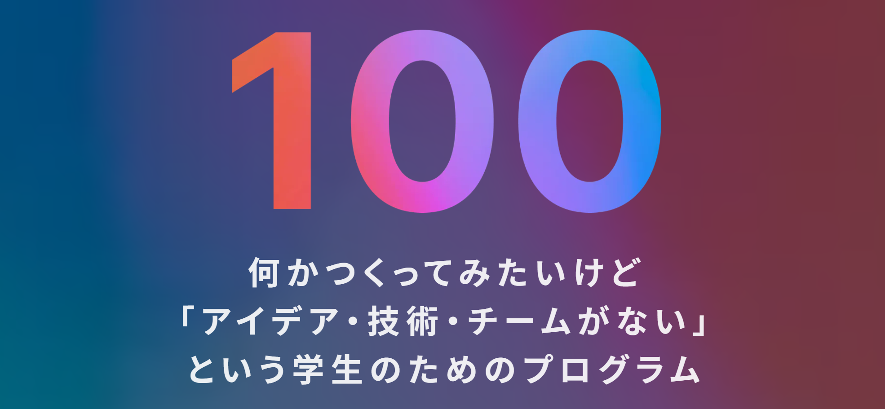

## Introduction

 

## Archived

## Languages

## Skills

## Participation

## References

- Introdution Cards 
https://github.com/vn7n24fzkq/github-profile-summary-cards 

- Archived trophy 
https://github.com/ryo-ma/github-profile-trophy 

- Skill aicons 
https://github.com/tandpfun/skill-icons#readme 

